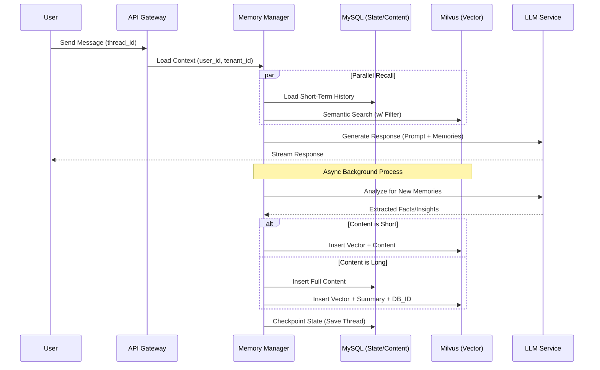

# 记忆管理工作流与生命周期文档 (Memory Workflow & Lifecycle)

## 1. 概述
本文档详细描述了记忆管理系统在 Agent 运行过程中的完整工作流程，包括记忆的形成、存储、召回、遗忘以及多租户权限控制的实现细节。

---

## 2. 核心概念：Context、Fact 与 Images

在 Agent 的记忆体系中，我们将记忆严格划分为以下三种类型，以应对不同场景下的召回与存储需求：

### 2.1 Context (短期上下文)
*   **定义**: 用户与 Agent 最近发生的对话历史（通常表现为滑动窗口，如最近 10 轮交互）。
*   **作用**: 让 Agent 了解当前的聊天语境，能够处理诸如“它是谁”、“上一个问题中提到的那个”等代词指代和连续追问。
*   **存储机制**: 强时效性。随着新对话的产生，旧的对话会被移出窗口。通常存储于关系型数据库（如 SQLite/MySQL 的短期记忆表）或进程内状态中。
*   **创建方式**: **全自动/被动**。只要发生对话，系统会在单次图执行完毕后自动将问答对（Human/AI Message）写入 Context。

### 2.2 Fact (长期事实记忆)
*   **定义**: 从用户历史交互中提取出的高价值、长期有效的信息。例如：“用户叫张三”、“用户是程序员”、“用户对海鲜过敏”。
*   **作用**: 使得 Agent 拥有跨会话（Cross-Session）的认知能力。即便相隔数月或刷新了页面丢失了 Context，Agent 依然能“认出”并“了解”用户。
*   **存储机制**: 向量化存储。文本被 Embedding 模型转换为向量后，存入 Milvus 等向量数据库。召回时通过用户当前输入的 Query 进行语义相似度匹配。
*   **创建机制 (主动与被动结合)**:
    1.  **AI 主动记忆 (Active/Auto Extraction)**: 在特定的业务流中，系统会在后台起一个异步任务，调用 LLM 对最近的 Context 进行分析（Prompt 类似于 "提取这段对话中关于用户身份、偏好的关键事实"）。如果 LLM 认为有价值，会自动总结并存入长期向量库。
    2.  **人工/系统显式添加 (Manual/Explicit)**: 某些强设定信息（如系统 onboarding 时填写的用户档案），可以通过特定 API 直接强制写入 Fact 库。在当前 LangGraph 实现中，也允许 Agent 在工具调用阶段显式调用“记忆存储工具”来写入 Fact。

### 2.3 Images (多模态图片记忆)
*   **定义**: 用户上传过的图片及其对应的特征与描述。
*   **作用**: 支持“图搜图”或“基于历史图片的问答”。例如用户发了一张猫的图片，稍后问“我刚才发的那只猫是什么颜色？”。
*   **存储机制**: 使用 CLIP（或类似多模态模型）将图片转换为特征向量，存入 Milvus 的专门 Collection 中；原图则存入本地文件系统或 OSS。
*   **创建机制**: **触发式被动创建**。当用户在聊天中携带了 `image` payload，或者调用了特定图片分析工具后，系统会自动提取图像向量并绑定 `user_id` 落库。

---

## 3. 核心工作流程

### 2.1 会话初始化 (Session Initialization)
当用户发起新的请求 (`POST /api/chat`) 时：
1.  **身份鉴权**:
    *   API 网关解析 JWT Token，提取 `user_id` 和 `tenant_id` (部门ID)。
    *   校验用户是否属于该部门。
2.  **状态加载 (State Loading)**:
    *   后端根据 `thread_id` 从 MySQL (`checkpoints` 表) 加载上一次的 `AgentState`。
    *   如果是新会话，初始化空的 `AgentState`，并记录 `user_id` 和 `tenant_id` 到 `chat_threads` 表。

### 2.2 记忆召回 (Memory Recall) - *Before Execution*
在 Agent 执行具体逻辑之前，`MemoryManager` 并行执行以下操作：
1.  **短期上下文 (Short-Term)**:
    *   从 `AgentState` 中提取最近 K 轮对话记录 (`messages`)。
2.  **长期记忆检索 (Long-Term)**:
    *   **语义检索**: 使用当前用户输入 (Query) 生成 Embedding 向量。
    *   **权限过滤**: 在 Milvus 中执行混合查询：
        ```python
        expr = f"tenant_id == {current_tenant} and (visibility == 'department' or (visibility == 'private' and user_id == {current_user}))"
        results = milvus.search(vector, expr=expr, limit=5)
        ```
    *   **重排序 (Rerank)**: (可选) 对检索结果进行相关性重打分。
3.  **上下文注入**:
    *   将检索到的长期记忆片段与短期对话历史合并，注入到 System Prompt 中：
        > "Here are some relevant memories: {long_term_memories}..."

### 2.3 记忆形成与存储 (Memory Formation) - *After Execution*
当 Agent 生成回复后，异步触发记忆更新流程：
1.  **短期记忆更新**:
    *   将最新的 User Message 和 AI Response 追加到 `AgentState`。
    *   **滑动窗口**: 如果消息列表超过 N 条，触发 Summarization (摘要) 机制，将旧消息压缩为摘要保留。
    *   **持久化**: 将更新后的 `AgentState` 保存到 MySQL (`checkpoints` 表)。
2.  **长期记忆提取 (Insight Extraction)**:
    *   **触发条件**: 每 N 轮对话或检测到关键信息（如用户偏好、重要事实）。
    *   **提取过程**: 调用 LLM 分析当前对话：
        > "Extract key facts, user preferences, or important tasks from the conversation."
    *   **存储策略**:
        *   **普通记忆**: 生成向量 -> 存入 Milvus (`agent_long_term_memory`)。
        *   **超长记忆**: 如果内容 > 8192 字符 -> 存入 MySQL (`memory_contents`) -> Milvus 仅存摘要和 ID。
        *   **多模态记忆**: 如果包含图片 -> 提取 CLIP 特征 -> 存入 Milvus (`agent_image_memory`) -> 图片文件存入 OSS。

### 2.4 记忆遗忘与维护 (Forgetting & Maintenance)
1.  **主动遗忘**: 用户显式请求删除某条记忆 -> `DELETE /api/memory/{id}` -> 物理删除 Milvus 和 MySQL 对应记录。
2.  **被动衰减**: (可选) 根据 `timestamp` 计算记忆的时间衰减权重，过旧且不重要的记忆将被定期清理或归档。
3.  **冲突修正**: 当提取的新事实与旧记忆冲突时（如用户更改了居住地），LLM 决策更新旧记忆而非简单的追加。

---

## 3. 时序图 (Sequence Diagram)



## 4. 关键技术实现细节

### 4.1 混合存储策略 (Hybrid Storage)
```python
async def save_long_term_memory(content: str, metadata: dict):
    if len(content) > 8000:
        # 1. 存入 MySQL 长文本表
        mem_id = await mysql.insert_content(content)
        # 2. 生成摘要
        summary = await llm.summarize(content)
        # 3. 存入 Milvus (带标记)
        await milvus.insert(vector, content=summary, has_ext=True, memory_id=mem_id)
    else:
        # 直接存入 Milvus
        await milvus.insert(vector, content=content, has_ext=False)
```

### 4.2 权限过滤表达式 (Permission Expression)
Milvus 查询时的动态表达式构建：
```python
def build_expr(user: User):
    # 基础条件：必须在同一个租户/部门下
    base_expr = f"tenant_id == {user.tenant_id}"
    
    # 可见性条件：
    # 1. 部门公开 (visibility == 'department')
    # 2. 或者是用户自己的私有记忆 (visibility == 'private' && user_id == me)
    # 3. (可选) 全局公开 (visibility == 'public')
    visibility_expr = f"(visibility == 'department' or (visibility == 'private' and user_id == {user.id}))"
    
    return f"{base_expr} and {visibility_expr}"
```
